# Predict Assessment Scores - Sourced from Kaggle
#### MSDS696 Data Science Practicum II

## PROJECT OVERVIEW
One measure of a successful online delivery course is the student’s assessment score or grade.  Analyzing what features have the most impact on assessment scores is a great way to identify potential areas of improvement to an online learning experience.  When course changes are made predicting the impact to assessments scores is equally important.  The Open University Learning Analytics dataset sourced from Kaggle contains demographic information for 28,785 students, student registrations, the assessment score data fir 7 courses, and summaries of student clicks on virtual learning environment (VLE).  I utilized the available data points, along with feature engineering, to train supervised learning models to predict assessment outcomes.

For the project, most of my time was spent working with regression models to predict assessment scores.  It was an amazing exercise in learning, but I was not entirely happy with the results.  For that reason, I also added some classification models to this research and simply predicted if the student passed or failed.  Of course, the results were better as the model was predicting pass or fail as opposed to a score from 0 to 100.  Going through this process, in an effort to make better predictions, allowed me to gain a much deeper understanding of the complexities in machine learning.  

## DATA

The data and variable descriptions came from from **Kaggle:**

https://www.kaggle.com/rocki37/open-university-learning-analytics-dataset/activity

https://analyse.kmi.open.ac.uk/open_dataset

### Open University Datasets

**Courses** - Modules and there presentations,
22 rows, 3 variables

| Variable       | Description          |
|:------------- |:-------------|
| code_module | Code name of the module. |
| code_presentation | Code name of the presentation. |
| length | Length in days of module/presentation. |

**Assessments** - Assessments in module presentations, 206 rows, 6 variables

| Variable       | Description          |
|:------------- |:-------------|
| code_module | ID code of module. |
| code_presentation | ID code of presentation. |
| id_assessment | ID number of assessment. |
| assessment_type | Tutor Marked Assessment (TMA), Computer Marked Assessment (CMA) and Final Exam (Exam). |
| date | Number of days since the start of the module-presentation. |
| weight | % weight of assessment. |

**Virtual Learning Environment (VLE)** - Available materials in the virtual learning environment (VLE),
6364 rows, 6 variables

| Variable       | Description          |
|:------------- |:-------------|
| id_site | ID number of material. |
| code_module | ID code of module. |
| code_presentation | ID code of presentation. |
| activity_type | Role associated with material. |
| week_from | Planned use from week. |
| week_to | Planned use to week. |

**Student Info** - Demographic information about students and their final result,
32,593 rows, 12 variables

| Variable       | Description          |
|:------------- |:-------------|
| code_module | ID code of module. |
| code_presentation | ID code of presentation. |
| id_student | ID number of student. |
| gender | Students gender. |
| region | Geographic region. |
| highest_education | highest student education level. |
| imd_band |  Index of Multiple Depravation. |
| age_band | Students age. |
| num_of_prev_attempts | Number of times module attempted by student. |
| studied_credits | Number of credits for module. |
| disability | Indicates if student declared disability. |
| final_result | Students final result of module. |

**Student Registration** - Student registration information for the module presentation,
32,593 rows, 5 variables

| Variable       | Description          |
|:------------- |:-------------|
| code_module | ID code of module. |
| code_presentation | ID code of presentation. |
| id_student | ID number of student. |
| date_registration | Date of students registration in days relative to modules start. |
| date_unregistration | Date of students registration in days relative to modules start.  Blank for students who complete course.  Students that unregister have a final result of 'Withdrawn'. |

**Student Assessment** - Results of student assessments, 173,912 rows, 5 variables

| Variable       | Description          |
|:------------- |:-------------|
| id_assessment | ID number of assessment.
| id_student | ID number of student. ||
| date_submitted | Date of students submission in days relative to modules start. |
| is_banked | Flag indicating assessment result transferred from previous presentation. |
| score | Assessment score from 0 - 100.  40 is considered 'Fail'. |

**Student VLE** - Students interactions with materials in the VLE,
10,655,280 rows, 6 variables

| Variable       | Description          |
|:------------- |:-------------|
| code_module | ID code of module. |
| code_presentation | ID code of presentation. |
| id_student | ID number of student. |
| id_site | ID number of material. |
| date | Date of student interaction with material. Measured in number of days since module start. |
| sum_click | Number of interactions by student with material in that day. |

## JOINS
The first challenge was to bring all of this data together into a cohesive machine learnable dataset, with meaningful features and assessment score as the target.  I knew I had 173,912 assessments with scores to train my models.  It quickly became apparent that students could have multiple assessment scores.  This translated to a dataset with  multiple rows for the same student with many common features and a different target score.  This could make training a model problematic.   

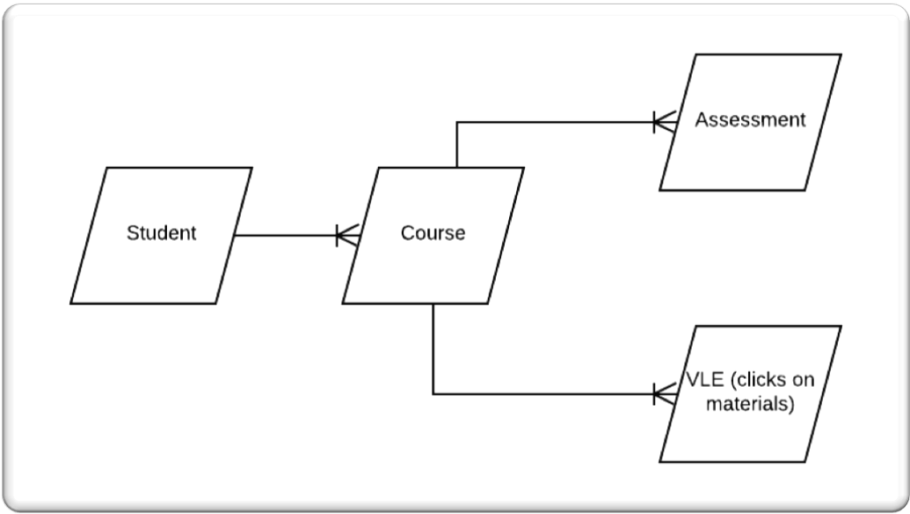

In an effort to gain a better understanding of machine learning, I decided to compare the results of two versions of the dataset in the regression models.  The first dataset is grouped by the student, includes the material click data which great adds to the feature count, and the average assessment score for each student is the target.  The second dataset does not include the click data and has a row for each assessment score for each student as the target.  Some features in the second dataset are not categorical and may provide enough variance to make decent predictions.  

**Click Dataset**
<table align="center">
    <tr>
        <td align="center"><b>Description</b></td>
        <td align="left">Average score per student and total clicks broken out by  course activity type.</td>
    </tr>
    <tr>
        <td align="center"><b>Structure</b></td>
        <td align="left">more features, less rows</td>
    </tr>
    <tr>
        <td align="center"><b>Rows/Features</b></td>
        <td align="left">37,030 rows, 38 features</td>
    </tr>
</table>


**Assessment Dataset**
<table align="center">
    <tr>
        <td align="center"><b>Description</b></td>
        <td align="left">All assessments with many repeated features (many assessments per student) and different outcome score.</td>
    </tr>
    <tr>
        <td align="center"><b>Structure</b></td>
        <td align="left">less features, more rows</td>
    </tr>
    <tr>
        <td align="center"><b>Rows/Features</b></td>
        <td align="left">153,537 rows, 19 features</td>
    </tr>
</table>

For both datasets, records with a final status of 'Witdrawn' and records that were missing an imd band were removed.

## FEATURE ENGINEERING

The following variables were feature engineered:

| Variable       | Description    |Dataset|
|:------------- |:-------------|:-------------|
| Average Click | Average clicks across all activity types for a student. |Click |
| Access Date | Date minus date submitted for both datasets. Date is the final date to complete assessment and date submitted is when it was taken, both in number of days since module start.|Click and Assessment |
| Module length to number of credits ratio| Length of module presentation in days divided by the number of credits for the module. |Click and Assessment |
| Total clicks by activity type by student | Total clicks on course materials for each student (e.g.page, questionnaire, quiz). |Click |


## EDA (EXPLORATORY DATA ANALYSIS)

### Correlation Matrix
 I created a correlation matrix for both datasets and did not see very strong correlations between any predictor variables.  I therefore did not remove any predictor variables.  

 <table>
   <tbody>
     <tr>
       <th align="center">Click Dataset</th>
       <th align="center">Assessment Dataset</th>
     </tr>
     <tr>
       <td>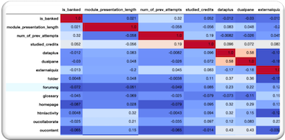</td>
       <td>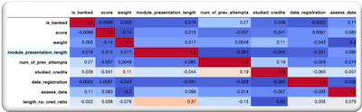</td>
     </tr>
  </table>

### Bar Plots
 Many bar plots were utilized to better understand the data. Below are a few that I found the most interesting.

 <table>
   <tbody>
     <tr>
       <th align="center">Assessment Type</th>
       <th align="center">Age Band</th>
       <th align="center">Final Result</th>
     </tr>
     <tr>
       <td>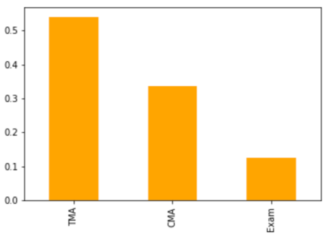</td>
       <td>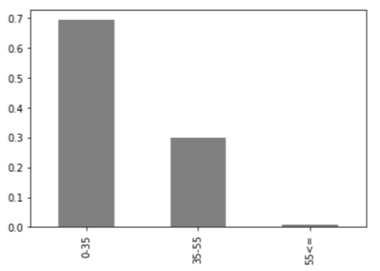</td>
       <td>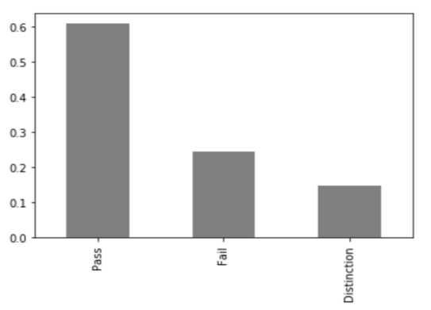</td>
     </tr>
  </table>

Tutor marked assessments (TMA) are the highest proportion of assessments types and final exams the lowest. Almost 70% of the students are less than 35 years old and over 20% of the students had a final result of 'Failed' with the remainder passing or passing with distinction.

### Boxplots
 <table>
   <tbody>
     <tr>
       <th align="center">Assessment Type</th>
       <th align="center">Age Band</th>
       <th align="center">Course Module</th>
     </tr>
     <tr>
       <td>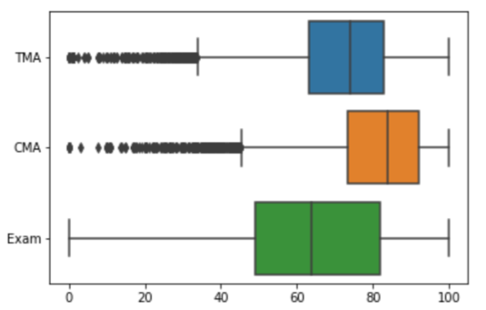</td>
       <td>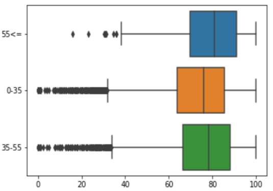</td>
       <td>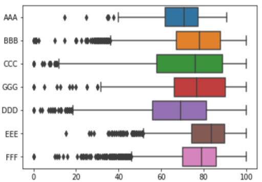</td>
     </tr>
  </table>

Some of the more interesting boxplots compared score to assessment type, age band, and course module.  Computer marked assessments had the highest median and exams the lowest.  When comparing score to age band, the age band with the highest score median was 55 and over.  Looking into the course setup, methods of delivery, and assessment details of course modules with the highest score median may help build more successful courses. Course modules EEE, FFF, and BBB had the highest score medians.  Using median for this part of the analysis seems to be a good measure as the median is less impacted by outliers.   

### Distribution of Data

I experimented with many scatterplots and other visualizations to get the basic shape of the data.  The better results came in a scatterplot that showed the correlation between average clicks (feature engineered predictor) and score.  

**Average Clicks/Score Scatter**

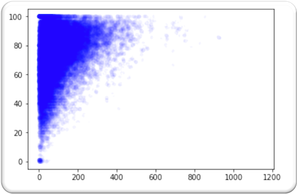

It's very clear that the lower scores had lower average clicks.  To be fair, there are plenty of higher scores with lower average clicks as well.  There does, however, seem to be a slight positive correlation.  Intuitively, this makes sense, as  more time spent working with course materials should result in a better course score.  

**Score Histograms**

<table>
  <tbody>
    <tr>
      <th align="center">Click Dataset</th>
      <th align="center">Assessment Dataset</th>
    </tr>
    <tr>
      <td>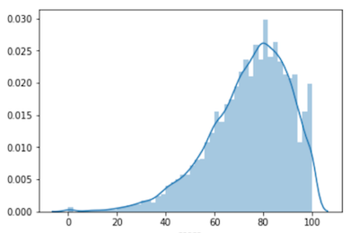</td>
      <td>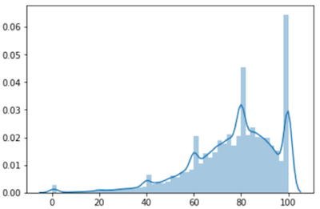</td>
    </tr>
 </table>

 Both datasets are left skewed, although the assessment dataset seems to be more left skewed than the click dataset.  The assessment dataset has 2 large spikes around 80 and 100.  The click dataset seems to be the closer of the two to a normal distribution.  Looking at this it does seem like linear models may not perform well with this data.  In the analysis section we'll see this does prove true as non-linear models have the best results.  

##  ANALYSIS

###  GridSearchCV

I utilized GridSearchCV to perform 5 fold cross validation and identify the optimal parameters for all of my models.  It took a long time to run each model, but it was worth it to obtain optimized parameters settings.

**Sample of GridSearchCV Code with parameter grid**  

``` python

rf = RandomForestRegressor(random_state=42)

parameters = { 'max_features':np.arange(5,10),'n_estimators':[500],'min_samples_leaf': [10,50,100,200,500]}

rf_gs = GridSearchCV(rf,parameters,scoring=scoring,refit='r2',cv=5,return_train_score=True)

start_time = timer(None)
rf_gs.fit(X_train, y_train)
timer(start_time)
```
###  Supervised Learning - Regression

**Model Result Measures**

I chose to measure the regression model results with the following 2 metrics:

**Adjusted r2** - r2 is the percentage of the variation in response variables that is explained by the model. (Editor, May,2013)  Adjusted r2 adjusts for multiple predictors and only increases the score if a predictor improves a model more than what chance would predict(Editor, June,2013).  The higher the adjusted r2, the better.

**Root Mean Square Error (RMSE)** - RMSE is the "standard deviation of the residuals" (RMSE, 2017).  The closer to zero (exact prediction), the better.  

**Model Results**

I started modeling with a linear regression model.  As suspected, the results were not great with an RSME of 12.82 and an adjusted r2 of 0.3798.  I also tried regularization with Ridge and Lasso but the results did not improve.  Below are the results of the top 3 models for each dataset.

**Click Dataset - Top 3 Models**
<table align="center">
    <tr>
        <td align="center"><b>Model</b></td>
        <td align="center"><b>Adjusted r2</b></td>
        <td align="center"><b>RMSE</b></td>
    </tr>
    <tr>
        <td align="left">Random Forest Regressor</td>
        <td align="left">0.5049</td>
        <td align="left">11.4554</td>
    </tr>
    <tr>
        <td align="left">Neural Netr</td>
        <td align="left">0.4628</td>
        <td align="left">11.9323</td>
    </tr>
    <tr>
        <td align="left">XGBoost</td>
        <td align="left">0.5278</td>
        <td align="left">11.1868</td>
    </tr>
</table>

XGBoost has the best adjusted r2 and the lowest RSME on the click dataset, although I was hoping for better overall results.  For each model, I ran predict on the train and test datasets.  I did this to compare the results of the fitted model on train and test, specifically to watch for overfitting.

**Predict vs. Actual for Train & Test Datasets - XGBoost (best model)**

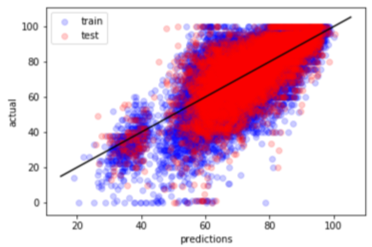

**Assessment Dataset - Top 3 Models**
<table align="center">
    <tr>
        <td align="center"><b>Model</b></td>
        <td align="center"><b>Adjusted r2</b></td>
        <td align="center"><b>RMSE</b></td>
    </tr>
    <tr>
        <td align="left">Random Forest Regressor</td>
        <td align="left">0.3748</td>
        <td align="left">14.4142</td>
    </tr>
    <tr>
        <td align="left">Neural Net</td>
        <td align="left">0.3308</td>
        <td align="left">14.9135</td>
    </tr>
    <tr>
        <td align="left">XGBoost</td>
        <td align="left">0.3455</td>
        <td align="left">14.7488</td>
    </tr>
</table>

Random Forest has the best adjusted r2 and the lowest RSME on the assessment dataset, but the overall results were far lower than the click dataset scores.  More features with less rows did much better with the regression models.  This makes sense, as more features give the model higher complexity and greater variance, ultimately allowing for better predictions.   

**Predict vs. Actual for Train & Test Datasets - Random Forest (best model)**

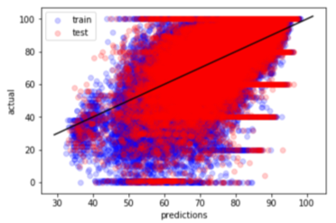

###  Random Forest - Important Features

To finish up regression modeling, I wanted to see if I could improve the random forest model on the click dataset and beat out XGBoost.  After observing the important features, I decided to rerun the model on the click dataset with the unimportant features removed, allowing for less noise in the model.

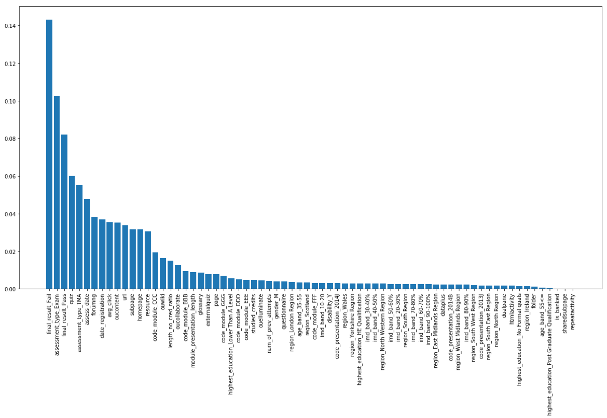

**Important Features Removed**

<table align="center">
    <tr>
        <td align="center"><b>Model</b></td>
        <td align="center"><b>Adjusted r2</b></td>
        <td align="center"><b>RMSE</b></td>
    </tr>
    <tr>
        <td align="left">Random Forest Regressor</td>
        <td align="left">0.5250</td>
        <td align="left">11.2207</td>
    </tr>
</table>

The model did slightly better than it's last run, but XGBoost still performed better.

###  Supervised Learning - Classification

Using the better performing click dataset, I ran classification models with a new target, final result (pass/fail).  This was not part of the original scope of the project, but not getting great results with the regression models prompted me to delve into classification modeling.  

**Model Result Measures**

I chose to measure the classification model results with the following 2 metrics:

**Kappa** - A conservative estimate of accuracy as it tells you how much better or worse the model is compared to random chance (Aaron, 2014).

**Area Under the Curve (AUC)** - Tells how well a model separates classes (Narkhede, 2018).  

<table align="center">
    <tr>
        <td align="center"><b>Model</b></td>
        <td align="center"><b>Kappa</b></td>
        <td align="center"><b>AUC</b></td>
    </tr>
    <tr>
        <td align="left">Logistic Regression</td>
        <td align="left">0.4750</td>
        <td align="left">0.85567</td>
    </tr>
    <tr>
        <td align="left">Random Forest Classifier</td>
        <td align="left">0.6020</td>
        <td align="left">0.91729</td>
    </tr>
</table>

Due to adding classification at the end of the project, I was only able to try two models.  Both performed well, but the Random Forest Classifier was the definite winner.  The kappa was .60 and the AUC was an impressive .92.  The classification models doing better than the regression models is not a surprise as there are only 2 final status outcomes.  With classification models, especially binary classification models, a model can be successful with random guessing. For this reason, I can see why the kappa score is so important.  

## CONCLUSIONS

* Sub par regression model results, more features could improve scores

* Regression models had much better results on click dataset (more features, less rows) than the assessment dataset (less features, more rows)

* GridSearchCV worked great to identify optimal parameters - Further hypertuning may improve results while being cautious about overfitting

* Predicting assessment scores would have been easier if there was one score per student, made things complex

* Ensemble models are powerful and produce impressive results

* It makes sense that classification performed better than regression, as binary classification had a 50% chance of making correct prediction

* Many of the feature engineered variables ended up being important features to the model, amazing how combinations of various features can improve a model

## REFERENCES

**Youtube Presentation** - https://youtu.be/QOKbdsLst2k

Aaron. (2014, August 12). How are kappa and overall accuracy related with respect to thematic raster data? Retrieved from https://gis.stackexchange.com/questions/110188/how-are-kappa-and-overall-accuracy-related-with-respect-to-thematic-raster-data

Editor, M. B. (2013, May 30). Regression Analysis: How Do I Interpret R-squared and Assess the Goodness-of-Fit? Retrieved from https://blog.minitab.com/blog/adventures-in-statistics-2/regression-analysis-how-do-i-interpret-r-squared-and-assess-the-goodness-of-fit

Editor, M. B. (2013, June 13). Multiple Regression Analysis: Use Adjusted R-Squared and Predicted R-Squared to Include the Correct Number of Variables. Retrieved from https://blog.minitab.com/blog/adventures-in-statistics-2/multiple-regession-analysis-use-adjusted-r-squared-and-predicted-r-squared-to-include-the-correct-number-of-variables

Kuzilek J., Hlosta M., Zdrahal Z. Open University Learning Analytics dataset Sci. Data 4:170171 doi: 10.1038/sdata.2017.171 (2017).

Narkhede, S. (2018, June 26). Understanding AUC - ROC Curve. Retrieved from https://towardsdatascience.com/understanding-auc-roc-curve-68b2303cc9c5

RMSE: Root Mean Square Error. (2017, November 14). Retrieved from https://www.statisticshowto.datasciencecentral.com/rmse/

Russell, R. (2018, October 27). Open University Learning Analytics Dataset. Retrieved from https://www.kaggle.com/rocki37/open-university-learning-analytics-dataset
