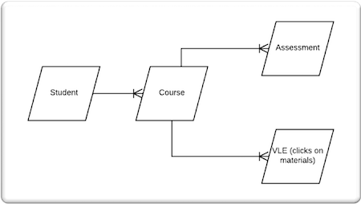

# Predict Assessment Scores - Sourced from Kaggle
#### MSDS696 Data Science Practicum II

## PROJECT OVERVIEW
One measure of a successful online delivery course is the student’s assessment score or grade.  Analyzing what features have the most impact on assessment scores is a great way to identify potential areas of improvement to an online learning experience.  The Open University Learning Analytics dataset sourced from Kaggle contains student demographics,  click data on course materials, student registrations, and assessment score information.  I utilized the available data points, along with feature engineering, to train supervised learning models to predict assessment outcomes.

For this project, I spent most of my time training regression models to predict assessment scores.  It was an amazing exercise in learning but I was not entirely happy with the results.  For that reason, I also added some classification models to this research and simply predicted if the student passed or failed.  Of course, the results where better as I was choosing pass or fail as opposed to a score from 0 to 100.  In the process of seeking better results, I feel like I gained some confidence in understanding the complexities of machine learning.  

## DATA

The data and variable descriptions came from from **Kaggle:**
https://www.kaggle.com/rocki37/open-university-learning-analytics-dataset/activity & https://analyse.kmi.open.ac.uk/open_dataset

### Open University Datasets

**Courses** - Modules and there presentations,
22 rows, 3 variables

| Variable       | Description          |
|:------------- |:-------------|
| code_module | Code name of the module. |
| code_presentation | Code name of the presentation. |
| length | Length in days of module/presentation. |

**Assessments** - Assessments in module presentations, 206 rows, 6 variables

| Variable       | Description          |
|:------------- |:-------------|
| code_module | ID code of module. |
| code_presentation | ID code of presentation. |
| id_assessment | ID number of assessment. |
| assessment_type | Tutor Marked Assessment (TMA), Computer Marked Assessment (CMA) and Final Exam (Exam). |
| date | Number of days since the start of the module-presentation. |
| weight | % weight of assessment. |

**Virtual Learning Environment (VLE)** - Available materials in the virtual learning environment (VLE),
6364 rows, 6 variables

| Variable       | Description          |
|:------------- |:-------------|
| id_site | ID number of material. |
| code_module | ID code of module. |
| code_presentation | ID code of presentation. |
| activity_type | Role associated with material. |
| week_from | Planned use from week. |
| week_to | Planned use to week. |

**Student Info** - Demographic information about students and their final result,
32,593 rows, 12 variables

| Variable       | Description          |
|:------------- |:-------------|
| code_module | ID code of module. |
| code_presentation | ID code of presentation. |
| id_student | ID number of student. |
| gender | Students gender. |
| region | Geographic region. |
| highest_education | highest student education level. |
| imd_band |  Index of Multiple Depravation. |
| age_band | Students age. |
| num_of_prev_attempts | Number of times module attempted by student. |
| studied_credits | Number of credits for module. |
| disability | Indicates if student declared disability. |
| final_result | Students final result of module. |

**Student Registration** - Student registration information for the module presentation,
32,593 rows, 5 variables

| Variable       | Description          |
|:------------- |:-------------|
| code_module | ID code of module. |
| code_presentation | ID code of presentation. |
| id_student | ID number of student. |
| date_registration | Date of students registration in days relative to modules start. |
| date_unregistration | Date of students registration in days relative to modules start.  Blank for students who complete course.  Students that unregister have a final result of 'Withdrawn'. |

**Student Assessment** - Results of student assessments, 173,912 rows, 5 variables

| Variable       | Description          |
|:------------- |:-------------|
| id_assessment | ID number of assessment.
| id_student | ID number of student. ||
| date_submitted | Date of students submission in days relative to modules start. |
| is_banked | Flag indicating assessment result transferred from previous presentation. |
| score | Assessment score from 0 - 100.  40 is considered 'Fail'. |

**Student VLE** - Students interactions with materials in the VLE,
1,0655,280 rows, 6 variables

| Variable       | Description          |
|:------------- |:-------------|
| code_module | ID code of module. |
| code_presentation | ID code of presentation. |
| id_student | ID number of student. |
| id_site | ID number of material. |
| date | Date of student interaction with material. Measured in number of days since module start. |
| sum_click | Number of interactions by student with material in that day. |

## JOINS
The first challenge was to bring all of this data together into a cohesive dataset that could be used for machine learning.  I knew I had 173,912 assessments with scores to train my models.  It quickly became apparent their were multiple assessments for each student.  After my joins, a student could have multiple assessment rows with many common features and a different target score.  This could make training a model problematic.   



In an effort to gain a better understanding of machine learning, I decided to compare the results of two versions of the dataset in the regression models.  The first dataset is grouped by the student, includes the material click data, and the average assessment score for each student is the target.  The second dataset does not include the click data and has a row each assessment score for each student as the target.  Some features the second dataset are not categorical and may provide enough variance for predictions.  

**Click Dataset**
<table align="center">
    <tr>
        <td align="center"><b>Description</b></td>
        <td align="left">Average score per student and total clicks broken out by  course activity type.</td>
    </tr>
    <tr>
        <td align="center"><b>Structure</b></td>
        <td align="left">more features, less rows</td>
    </tr>
    <tr>
        <td align="center"><b>Rows/Features</b></td>
        <td align="left">37,030 rows, 38 features</td>
    </tr>
</table>


**Assessment Dataset**
<table align="center">
    <tr>
        <td align="center"><b>Description</b></td>
        <td align="left">All assessments with many repeated features (many assessments per student) and different outcome score.</td>
    </tr>
    <tr>
        <td align="center"><b>Structure</b></td>
        <td align="left">less features, more rows</td>
    </tr>
    <tr>
        <td align="center"><b>Rows/Features</b></td>
        <td align="left">153,537 rows, 19 features</td>
    </tr>
</table>

For both datasets, records with a final status of 'Witdrawn' and records that were missing an imd band were removed.

## FEATURE ENGINEERING

The following variables were feature engineered:

| Variable       | Description    |Dataset|
|:------------- |:-------------|:-------------|
| Average Click | Average clicks across all activity types for a student. |click |
| Access Date | date minus date submitted for both datasets. Date is the final date to complete assessment and date submitted is when it was taken. |click and assessment |
| Module length to number of credits ratio | length of module presentation in days divided by the number of credits for the module. |click and assessment |
| Total clicks by activity type by student  | Total clicks on course materials for each student (e.g.page, questionnaire, quiz). |click |


## EDA (EXPLORATORY DATA ANALYSIS)

### Correlation Matrix
 I created a correlation matrix for both datasets and did not see very strong correlations between any predictor variables.

 <table>
   <tbody>
     <tr>
       <th align="left">Click Dataset</th>
       <th align="center">Assessment Dataset</th>
     </tr>
     <tr>
       <td></td>
       <td></td>
     </tr>
  </table>

### Bar Plots
 Many bar plots were utilized to better understand the data. Below are a few that I found the most interesting.

 <table>
   <tbody>
     <tr>
       <th align="left">Assessment Type</th>
       <th align="center">Age Band</th>
       <th align="center">Final Result</th>
     </tr>
     <tr>
       <td></td>
       <td></td>
       <td></td>
     </tr>
  </table>

Tutor marked assessments (TMA) are the highest proportion of assessments types and final exams the lowest. Almost 70% of the students are less than 35 years old and over 20% of the students had a final result of 'Failed' with the remainder passing or passing with distinction.

### Boxplots
 <table>
   <tbody>
     <tr>
       <th align="left">Assessment Type</th>
       <th align="center">Age Band</th>
       <th align="center">Course Module</th>
     </tr>
     <tr>
       <td></td>
       <td></td>
       <td></td>
     </tr>
  </table>

Some of the more interesting boxplots compared score to assessment type, age band, and course module.  Computer marked assessments had the highest median and exams the lowest.  When comparing score to age band, the age band with the highest score median was 55 and over.  Looking into the course setup, methods of delivery, and assessment details of course modules with the highest score median may help build more successful courses. Course modules EEE, FFF, and BBB had the highest score medians.  Using median for this part of the analysis seems to be a good measure as the median is less impacted by outliers.    

##  ANALYSIS

### Sentiment Analysis

``` python

    analysis = TextBlob(Reviews)
    if analysis.sentiment.polarity >= .3:
        return 1
    elif analysis.sentiment.polarity < .3 and analysis.sentiment.polarity >= -.3 :
        return 0
    else:
        return -1
```

Text for rating 1/positive sentiment review:
> Same as every other tech company now. They will only pay the top people what they want then the rest are left to pick up the pieces. Tesla name carries weight and they know it.

Sounds like negative sentiment to me! Here is how TextBlob scored it.  

``` python
Sentiment(polarity=0.075, subjectivity=0.4, assessments=[(['same'], 0.0, 0.125, None), (['other'], -0.125, 0.375, None), (['only'], 0.0, 1.0, None), (['top'], 0.5, 0.5, None), (['left'], 0.0, 0.0, None)])
```
TextBlob give a high polarity and subjectivity score for the word 'top' and does not recognize context of the word. After a conversation with Dr. George, in the future it may be beneficial to train my own sentiment classifier.  

### Term Frequency-Inverse Document Frequency(TF-IDF)
Two different methods were used to extract topics from the review text.  Both methods needed a TF-IDF vector created from the review terms as input.  

``` python
# TFIDF - fit/transform
# min_df=3 ignores terms occuring in less than 3 documents
#Code from Week 4 Solution - Regis Text Analytics Class - Dr. Nathan George

# Instantiate tfidf vectorizer and fit_transform
tfidf_vectorizer_google = TfidfVectorizer(min_df=3,ngram_range=(1,1))
train_tfidf_vectors_google = tfidf_vectorizer_google.fit_transform(cln_review_google)

tfidf_vectorizer_tesla = TfidfVectorizer(min_df=3,ngram_range=(1,1))
train_tfidf_vectors_tesla = tfidf_vectorizer_tesla.fit_transform(cln_review_tesla)
```

### Clustering/K-medoids/Latent Semantic Analysis(LSA)

Latent Semantic Analysis (LSA) was used on the TF-IDF vector for feature reduction to improve some performance issues. LSA reduced the Google dataset to 400 components that explained 78% of the variance and Tesla to 400 components that explained 79% of the variance.


``` python
# google - Kmedoids - with optimal clusters

# Code source
# https://github.com/annoviko/pyclustering/blob/master/pyclustering/cluster/ema.py
# https://github.com/annoviko/pyclustering/issues/366
# https://codedocs.xyz/annoviko/pyclustering/classpyclustering_1_1cluster_1_1kmedoids_1_1kmedoids.html
# https://github.com/letiantian/kmedoids

# set random initial medoids
initial_medoids_google = list(range(0,17))

# create instance of K-Medoids algorithm
kmedoids_instance_google = kmedoids(google_list, initial_medoids_google)

# run cluster analysis and obtain results
kmedoids_instance_google.process();
clusters_google = kmedoids_instance_google.get_clusters()
medoids_google = kmedoids_instance_google.get_medoids();

print("Amount of clusters - Google:", len(clusters_google));
for cluster in clusters_google:
    print("Cluster length:", len(cluster));
```
The documents under each identified cluster were grouped and a calculation was performed to get the average TF-IDF. This was done to rank the clusters by highest average TF-IDF. Then, for the highest average TF-IDF the top words by word frequency were examined. See the results for the cluster with the highest TF-IDF below.

The pyclustering library seems to have its challenges with performance and accuracy. For the future, running k-medoids clustering in R, which seems to have more options, may improve results. Also, trying other clustering algorithms like k-means and KNN may prove beneficial.

### Non-negative matrix factorization (NMF)/Latent Dirichlet Allocation (LDA)

Topic modeling was done using Non-negative matrix factorization (NMF) and Latent Dirichlet Allocation (LDA).


## CONCLUSIONS

* Analysis matched perceived organizational cultures

* Simple Word Counts Impressive

* Semantic analysis – Train Classifier

* K-Medoids clustering a bit of a struggle – More options in R

* Good Results with Topic Modeling

* Additional Stop Words


## REFERENCES

**Youtube Presentation**
https://youtu.be/0BFaGmPbY_k

George, P. (2018, December 13). Working at Tesla Means Being in an 'Abusive Relationship' With Elon Musk: Report. Retrieved from https://jalopnik.com/working-at-tesla-means-being-in-an-abusive-relationship-1831072258

Schneider, M. (2017, July 26). Google Gets 2 Million Applications a Year. To Have a Shot, Your Resume Must Pass the '6-Second Test'. Retrieved from https://www.inc.com/michael-schneider/its-harder-to-get-into-google-than-harvard.html

Thibodeaux, W. (2018, September 19). 67 Percent of Recruiters Say It's Harder Than Ever to Find Talent. Here's How to Beat the Odds. Retrieved from https://www.inc.com/wanda-thibodeaux/67-percent-of-recruiters-say-its-harder-than-ever-to-find-talent-heres-how-to-beat-odds.html
